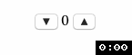

# Challenge

- `Counter` component looks like the below  
  
- Usage of `Counter`

  ```js
  const handleChange = value => {
    // handle change of the `value`
  };
  const counter = new Counter({
    selector: '#app',
    value: 1,
    onChange: handleChange
  });
  counter.render();
  ```

  - `selector`: the selector specifies the HTML element where the `Counter` component will be rendered to
  - `value`: the default value of the component
  - `onChange`: the callback function which will be triggered when you click on "▼"/"▲" button
  - `render()`: render the component to the DOM

* Write unit test for the `Counter` component, verify the following behaviors
  - When the component is rendered, test the value will be displayed correctly
  - When clicking on "▲" button, the value will be increased
  - When clicking on "▼" button, the value will be decrease 

## Hint

- Ref. [DOM Manipulation](https://jestjs.io/docs/en/tutorial-jquery)
- Use `jest.fn()` to mock the event handler function
